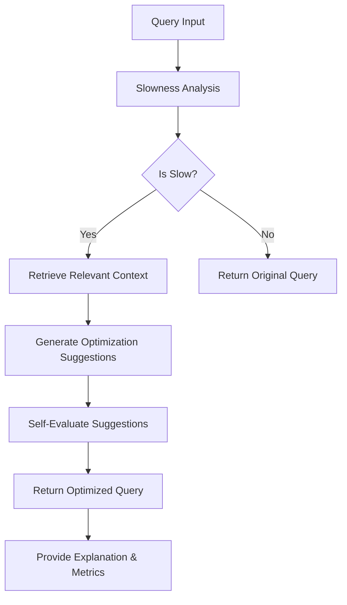

# Query Optimization Agentic AI

An intelligent query optimization system that uses LangChain and RAG (Retrieval-Augmented Generation) to analyze and optimize database queries. The system evaluates query performance, identifies optimization opportunities, and provides actionable suggestions.

## 🌟 Features

- **Query Performance Analysis**: Measures query execution time and calculates slowness scores
- **RAG-based Optimization**: Uses Retrieval-Augmented Generation to find relevant optimization patterns
- **Multi-source Knowledge**: Leverages multiple documentation sources including SQL anti-patterns, Databricks optimizations, and Spark performance tuning
- **Self-evaluation**: Includes mechanisms to validate optimization suggestions
- **Adaptive Retrieval**: Dynamically adjusts retrieval strategy based on query characteristics

## 🚀 Prerequisites

Before you begin, ensure you have the following installed:

- Python 3.8+
- pip (Python package manager)
- Git
- [Poetry](https://python-poetry.org/) (recommended for dependency management)

## 🛠️ Installation

1. **Clone the repository**:
   ```bash
   git clone https://github.com/yourusername/query-opt-agentic-ai.git
   cd query-opt-agentic-ai
   ```

2. **Set up environment variables**:
   Create a `.env` file in the root directory with the following variables:
   ```
   GROQ_API_KEY=your_groq_api_key
   OPENAI_API_KEY=your_openai_api_key
   LANGSMITH_API_KEY=your_langsmith_api_key
   LANGSMITH_TRACING=true
   LANGSMITH_ENDPOINT=https://api.smith.langchain.com
   LANGSMITH_PROJECT=query-opt-agentic-ai

   ```

3. **Install dependencies**:
   Using Poetry:
   ```bash
   poetry install
   ```
   
   Or using pip:
   ```bash
   pip install -r requirements.txt
   ```

## 🏗️ Architecture



### Core Components

1. **Query Analysis**
   - Measures query execution time
   - Calculates slowness score
   - Identifies potential bottlenecks

2. **Context Retrieval**
   - Uses multiple document sources for optimization patterns
   - Implements adaptive retrieval based on query characteristics
   - Supports PDF and JSON document formats

3. **Optimization Engine**
   - Applies optimization rules based on retrieved context
   - Generates optimized query variants
   - Validates optimizations using self-evaluation

4. **Response Generation**
   - Provides detailed optimization reports
   - Includes performance improvement estimates
   - Offers explanations for suggested changes

## 📖 Usage

1. **Run the Jupyter notebook**:
   ```bash
   jupyter notebook agentic-ai.ipynb
   ```

2. **Example Query Analysis**:
   ```python
   # Example query metadata
   initial_state = {
        "query": {
            "user_name": "alice",
            "statement_text": "SELECT * FROM orders WHERE amount > 1000",
            "status": "SUCCESS",
            "start_time": "2025-01-01T10:00:00",
            "end_time": "2025-01-01T10:06:00"
        }
    }

   final_state = app.invoke(initial_state)
   ```
   ***Real World Scenario***
   In the real world scenario with DataBricks the input can be from 
   **system.query history**
   ```sql
   SELECT 
    statement_text,
    executed_as,
    start_time,
    total_duration_ms,
    produced_rows
    FROM system.query.history
    WHERE update_time >= CURRENT_DATE() - INTERVAL 7 DAYS
    ORDER BY total_duration_ms DESC
    LIMIT 10;
```

3. **View Optimization Results**:
   The system will provide:
   - Original query analysis
   - Identified optimization opportunities
   - Optimized query (if applicable)
   - Performance improvement estimates
   - Confidence scores for suggestions

## 📂 Project Structure

```
query-opt-agentic-ai/
├── agentic-ai.ipynb     # Main Jupyter notebook with implementation
├── README.md            # This file
├── .env.example         # Example environment variables
├── requirements.txt     # Python dependencies
├── playbooks/           # Documentation and optimization guides
│   ├── SQL_anti_pattern.pdf
│   ├── Optimize_Databricks_Queries_overcast.pdf
│   └── spark_perf_tunning.pdf
└── stats/               # Table statistics and metadata
    └── table_stats.json
```

## 🤝 Contributing

1. Fork the repository
2. Create a feature branch (`git checkout -b feature/AmazingFeature`)
3. Commit your changes (`git commit -m 'Add some AmazingFeature'`)
4. Push to the branch (`git push origin feature/AmazingFeature`)
5. Open a Pull Request

## 📄 License

This project is licensed under the MIT License - see the [LICENSE](LICENSE) file for details.

## 🙏 Acknowledgments

- [LangChain](https://python.langchain.com/) for the agent framework
- [HuggingFace](https://huggingface.co/) for embedding models
- [Chroma](https://www.trychroma.com/) for vector storage
- [FAISS](https://github.com/facebookresearch/faiss) for efficient similarity search
